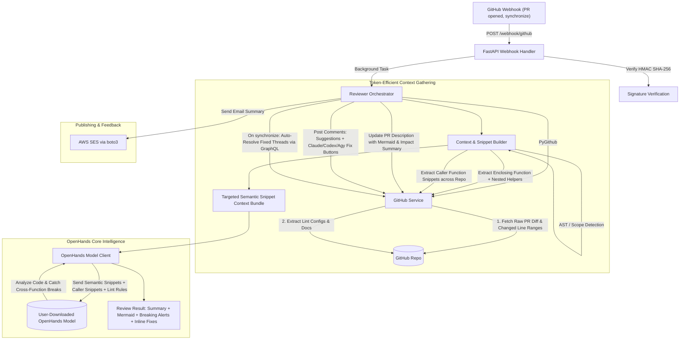

# Implementation Plan: AI-Powered GitHub PR Reviewer ("auto-code-reviewer")

An open-source, containerized, FastAPI-based automation service that intercepts GitHub Pull Request webhook events (`opened`, `synchronize`), connects to an **OpenHands agent environment** or local LLM (such as **DeepSeek-Coder** via Ollama), and performs **token-efficient, semantic cross-function impact analysis**.

Instead of costly full-file dumps or blind diff hunks, `auto-code-reviewer` intelligently extracts the **complete enclosing functions/methods (including nested helpers and decorators)** around modified lines, along with relevant **caller function snippets** across the repo. It understands function relationships, catches downstream breaking changes, generates PR descriptions with architectural Mermaid.js diagrams, and posts inline PR reviews featuring:
1. **GitHub One-Click Suggestion blocks** (` ```suggestion `).
2. **Actionable Fix Buttons & Links** (launching with preloaded prompts in Claude Code, Codex, or Antigravity CLI).
3. **Copyable Terminal/Agent Prompts** for Claude Code (`claude`), Antigravity CLI (`agy`), and Codex.
4. **Cross-File Breaking Change Warnings** (alerting developers if modified function signatures break callers).
5. **Auto-Resolution** of fixed threads on subsequent commits via GitHub's GraphQL API.
6. **Review Notifications** via AWS SES (`boto3`).

Ready for local Docker execution or deployment to a cloud VPS like **Vultr**.

---

## User Review Required

> [!IMPORTANT]
> **Token-Efficient Semantic Snippet Extraction (Not Blind Full Files)**
> Loading multi-thousand line files is expensive and wastes token budget.
> `auto-code-reviewer` uses an AST/block-aware extractor (`ContextBuilder`):
> 1. **Enclosing Function/Method Scope**: Locates the complete function, method, class header, and nested functions containing the diff changes.
> 2. **Header Context**: Captures module imports and constants without loading the remaining thousands of unrelated lines.
> 3. **Targeted Caller Snippets**: When a modified function signature changes, extracts only the specific calling functions from dependent files.
>
> This gives OpenHands complete semantic visibility while reducing token usage by ~70–90%!

> [!NOTE]
> **OpenHands as the Core Reviewer Model**
> Developers download and run the OpenHands model locally or on a server. `auto-code-reviewer` communicates with this model endpoint (`OPENHANDS_ENDPOINT`) to perform the deep code understanding, criticism, and Mermaid diagram generation.

---

## Architecture Overview



---

## Cross-File Regression & Fix Comment Example

When `auto-code-reviewer` identifies an issue or a potential downstream break:

````markdown
### ⚠️ Breaking Change Warning: Modified Signature Breaks Dependent Callers
In `app/services/auth.py`, `get_current_user` now requires an additional `tenant_id` argument without a default value.

**Downstream Impact:**
The caller in `app/api/endpoints/users.py` line 34 still invokes `get_current_user(token)` without `tenant_id`, which will raise a `TypeError` at runtime.

#### 1. Apply Direct Fix (GitHub Suggestion)
```suggestion
def get_current_user(token: str, tenant_id: Optional[str] = None) -> User:
```

#### 2. Fix in AI Tools (Click to Launch / Preloaded Prompt)
[](https://claude.ai/new?q=Fix%20signature%20in%20app%2Fservices%2Fauth.py%20to%20avoid%20breaking%20users.py)
[](https://chatgpt.com/?q=Fix%20signature%20in%20app%2Fservices%2Fauth.py)
[](file:///open-terminal)

#### 3. Or Copy Preloaded Terminal Prompt
**Antigravity CLI (`agy`):**
```bash
agy "Make tenant_id optional in get_current_user in app/services/auth.py to prevent breaking app/api/endpoints/users.py"
```

**Claude Code CLI:**
```bash
claude "Make tenant_id optional in get_current_user in app/services/auth.py to prevent breaking app/api/endpoints/users.py"
```
````

---

## Project Structure

```
auto-code-reviewer/
├── .github/
│   └── workflows/
│       └── ci.yml                # CI: Tests, Linting, Docker build verification
├── app/
│   ├── __init__.py
│   ├── main.py                   # FastAPI app & webhook routes
│   ├── config.py                 # App settings (OpenHands endpoint, GitHub, AWS SES)
│   ├── models/
│   │   ├── __init__.py
│   │   ├── github_models.py      # Pydantic schemas for GitHub webhook payloads
│   │   └── review_models.py      # Schemas for OpenHands review results & breaking changes
│   └── services/
│       ├── __init__.py
│       ├── openhands_client.py   # OpenHands model client (code understanding & criticism)
│       ├── context_builder.py    # AST-aware enclosing function & caller snippet extractor
│       ├── prompt_builder.py     # Multi-tool fix generator (Claude, Codex, AGY buttons & prompts)
│       ├── github_service.py     # PyGithub + GraphQL client (diff, snippets, comments, resolve)
│       ├── ses_service.py        # AWS SES email notifications
│       └── reviewer.py           # Review pipeline orchestrator
├── deploy/
│   ├── setup_vultr.sh            # 1-click deployment script for Vultr VPS
│   └── Caddyfile                 # Automatic HTTPS reverse proxy for webhooks
├── tests/
│   ├── __init__.py
│   ├── test_webhook.py           # Webhook signature & dispatch tests
│   ├── test_context_builder.py   # Function snippet & caller extraction tests
│   ├── test_openhands_client.py  # OpenHands model integration tests
│   └── test_github_service.py    # GitHub diff & comment formatting mock tests
├── Dockerfile                    # Multi-stage container definition
├── docker-compose.yml            # Docker Compose orchestration
├── .dockerignore
├── .env.example                  # Environment configuration template
├── .gitignore
├── LICENSE                       # MIT License
├── CONTRIBUTING.md               # Community contribution guidelines
├── IMPLEMENTATION_PLAN.md        # Workspace copy of this plan
├── requirements.txt              # Core Python dependencies
└── README.md                     # Setup, OpenHands download guide, local & Vultr deployment
```

---

## Detailed Components

### Component 1: Context & Snippet Extractor (`app/services/context_builder.py`)
- **Enclosing Scope Detection**:
  - Uses AST (for Python) and indentation/block pattern matching (for general languages) to locate the exact enclosing function or method definition for modified diff lines.
  - Automatically includes:
    - Function signature, decorators, docstring.
    - Full function body and any nested helper functions or closures.
    - File import header.
- **Targeted Caller Extraction**:
  - Detects if modified functions had their names, parameter lists, or return statements modified.
  - Finds calling functions in dependent files and extracts only the caller method snippet, not the whole file.
- **Cost Reduction**:
  - Eliminates token bloat while guaranteeing full semantic context for the AI model.

### Component 2: OpenHands Model Client (`app/services/openhands_client.py`)
- Connects to user-downloaded OpenHands model via REST API / OpenAI-compatible endpoint (defaulting to non-conflicting port `http://localhost:50000/api` or `http://localhost:11434/v1`).
- Evaluates:
  1. **Feature Understanding & Architecture**: Generates Mermaid.js diagram illustrating component interactions.
  2. **Code Criticism**: Identifies bugs, performance issues, and lint violations.
  3. **Downstream Break Detection**: Explicitly verifies whether changed signatures, altered return types, or deleted parameters break caller modules.
  4. **Targeted Fixes**: Formulates exact code fixes.

### Component 3: Multi-Tool Fix Builder (`app/services/prompt_builder.py`)
- Converts OpenHands suggestions into:
  - GitHub ` ```suggestion ` blocks.
  - Clickable button badges for Claude Code, Codex, and AGY.
  - Copyable terminal commands (`agy "..."`, `claude "..."`) and Codex prompts.

### Component 4: GitHub & SES Operations (`app/services/github_service.py`, `ses_service.py`)
- GitHub API: Updates PR body with Mermaid diagram and impact summary, publishes inline comments, auto-resolves threads on `synchronize` via GraphQL.
- AWS SES: Sends review summary email with breaking change flags and metrics.

### Component 5: Deployment & Open Source
- `Dockerfile` & `docker-compose.yml` for local containerization.
- `deploy/setup_vultr.sh` & `deploy/Caddyfile` for 1-click Vultr deployment with automatic HTTPS.
- Open-source files: `LICENSE` (MIT), `CONTRIBUTING.md`, `.github/workflows/ci.yml`.

---

## Verification Plan

### Automated Tests
1. `pytest tests/test_context_builder.py`: Test extracting enclosing function, nested functions, and caller snippets from a sample source file.
2. `pytest tests/test_webhook.py`: Valid and invalid HMAC signatures, event routing.
3. `pytest tests/test_openhands_client.py`: OpenHands payload construction and review parsing.
4. `pytest tests/test_github_service.py`: Comment formatting (suggestions, badges, copy commands) and thread auto-resolution.

### Manual Verification
1. Run local container: `docker compose up --build`.
2. Verify `/health` endpoint.
3. Test with multi-file mock PR to verify that caller snippets are retrieved and analyzed for breaking changes without loading unnecessary lines.
4. Run `deploy/setup_vultr.sh` on Vultr instance and test webhook receipt.
