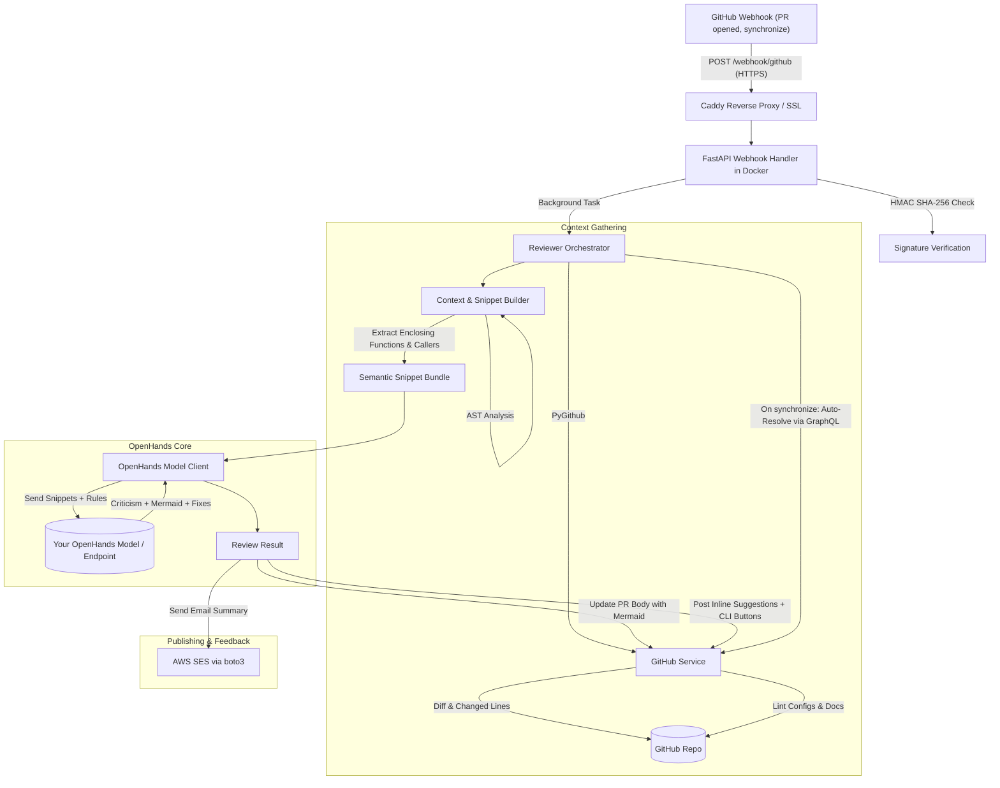

# 🤖 auto-code-reviewer

[](LICENSE)
[](https://www.python.org/downloads/)
[](https://fastapi.tiangolo.com)
[](https://www.docker.com/)

An open-source, containerized AI code review assistant. It hooks into your GitHub Pull Request workflow, connects to a self-hosted **OpenHands** model, analyzes full semantic function scopes and cross-file dependencies, updates the PR description with an architectural **Mermaid.js** diagram, and posts inline review comments with one-click fix buttons for **GitHub**, **Claude Code**, **Codex**, and **Antigravity CLI (`agy`)**.

---

## 🌟 Key Features

- **🧠 OpenHands Intelligence**: Connects directly to your locally downloaded or self-hosted OpenHands model to understand, criticize, and propose fixes.
- **⚡ Token-Efficient Semantic Scope**: Unlike tools that blindly load entire 3,000-line files or inspect only isolated diff hunks, `auto-code-reviewer` uses AST analysis to extract the **complete enclosing functions, methods, and nested helpers**, cutting token cost by ~80% while retaining full semantic context.
- **🔍 Cross-File Breaking Change Detection**: Identifies callers across dependent repository files and warns you if modified function signatures or return contracts break other modules.
- **🛠️ Multi-Tool Fix Options on Every Issue**:
  1. **GitHub One-Click Suggestion**: Apply directly via GitHub UI (` ```suggestion `).
  2. **Preloaded App Badges**: Clickable buttons for **Claude Code** and **Codex** with preloaded prompts.
  3. **Copyable CLI Prompts**: Ready-to-run terminal commands for **Antigravity CLI (`agy`)** and **Claude Code (`claude`)**.
- **🔄 Auto-Resolves Fixed Threads**: When developers push a subsequent commit addressing an issue, `auto-code-reviewer` automatically resolves the GitHub conversation thread via the GitHub GraphQL API.
- **📧 AWS SES Notifications**: Sends formatted HTML review summary emails to reviewers via `boto3` (with dry-run mode for local dev).
- **🚀 1-Click Vultr VPS & Docker Deployment**: Automated setup script for Ubuntu VPS on Vultr with Caddy for automatic Let's Encrypt HTTPS.

---

## 🏗️ Architecture



---

## 🚀 Quickstart

### 1. Download & Run the OpenHands Model
You can run OpenHands or any local code-capable model using Ollama, vLLM, or the OpenHands server container:

```bash
# Example: Running an OpenAI-compatible OpenHands server on port 3000
docker run -d --name openhands-model -p 3000:3000 ghcr.io/all-hands-ai/openhands:latest
```

### 2. Configure Environment
```bash
git clone https://github.com/your-username/auto-code-reviewer.git
cd auto-code-reviewer

cp .env.example .env
```

Edit `.env` with your credentials:
```ini
GITHUB_TOKEN=ghp_your_github_personal_access_token
GITHUB_WEBHOOK_SECRET=your_webhook_secret_here
OPENHANDS_ENDPOINT=http://localhost:3000/api
```

### 3. Run with Docker Compose
```bash
docker compose up --build
```
The service will be live at `http://localhost:8000`. Health check:
```bash
curl http://localhost:8000/health
# {"status":"ok","service":"auto-code-reviewer","version":"0.1.0","environment":"development"}
```

---

## 🌐 Deploying to Vultr VPS

To receive public GitHub webhooks over HTTPS, deploy to a VPS like **Vultr Cloud Compute**:

### 1. Create a Vultr Instance
- **OS**: Ubuntu 22.04 or 24.04 LTS
- **Plan**: Cloud Compute ($6/mo - 1 vCPU / 1GB or 2GB RAM)
- **Firewall**: Ensure ports `22`, `80`, `443`, and `8000` are allowed.

### 2. Run the 1-Click Provisioning Script
SSH into your Vultr VPS:
```bash
git clone https://github.com/your-username/auto-code-reviewer.git
cd auto-code-reviewer

# Run setup script
sudo bash deploy/setup_vultr.sh
```
The script will:
1. Install Docker and Docker Compose.
2. Configure UFW firewall.
3. Prompt for your domain (e.g. `reviewer.yourdomain.com`) to enable automatic Let's Encrypt HTTPS via Caddy.
4. Launch the containers with `restart: unless-stopped`.

### 3. Add the Webhook to GitHub
1. Navigate to your GitHub repository -> **Settings** -> **Webhooks** -> **Add webhook**.
2. **Payload URL**: `https://reviewer.yourdomain.com/webhook/github` (or `http://<VULTR_IP>:8000/webhook/github`).
3. **Content type**: `application/json`.
4. **Secret**: Enter the value of `GITHUB_WEBHOOK_SECRET` from your `.env`.
5. **Which events?**: Select **"Let me select individual events"** and check **"Pull requests"**.
6. Click **Add webhook**.

---

## 🧪 Testing

Run the automated test suite with `pytest`:

```bash
# Activate virtual environment
source .venv/bin/activate

# Run tests
pytest -v
```

---

## ⚙️ Configuration Reference

| Environment Variable | Default | Description |
| :--- | :--- | :--- |
| `GITHUB_TOKEN` | *Required* | GitHub PAT or App token with `repo` scope |
| `GITHUB_WEBHOOK_SECRET` | *Required* | Secret used to verify HMAC SHA-256 signatures |
| `OPENHANDS_ENDPOINT` | `http://localhost:3000/api` | URL of your self-hosted OpenHands model endpoint |
| `OPENHANDS_MODEL_NAME` | `openhands-code-reviewer` | Target model name |
| `ANTHROPIC_API_KEY` | *Optional* | Fallback Claude API key if OpenHands endpoint is unreachable |
| `ANTHROPIC_MODEL` | `claude-3-5-sonnet-20241022` | Claude model name |
| `AGY_BIN_PATH` | `agy` | Path to Antigravity CLI binary |
| `AWS_REGION` | `us-east-1` | AWS region for SES email delivery |
| `SES_SENDER_EMAIL` | `reviewer-bot@yourdomain.com` | Verified AWS SES sender email |
| `SES_DEFAULT_RECIPIENT`| `dev-team@yourdomain.com` | Fallback notification email |
| `SES_DRY_RUN` | `false` | When true, logs email notifications without sending |

---

## 🤝 Contributing

Contributions are welcome! Please check out [CONTRIBUTING.md](CONTRIBUTING.md) for details on code style, testing, and submitting pull requests.

## 📄 License

This project is licensed under the [MIT License](LICENSE).
